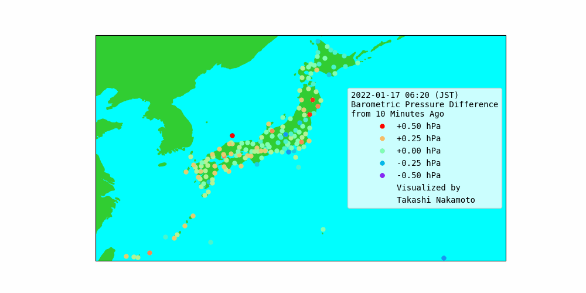

# Visualization of Shockwave from Tonga

The animation below shows the shockwave generated by the massive volcanic eruption in Tonga. Dots in the map of Japan below represent the barometric pressure difference from 10 minutes ago.

## First shockwave directly coming from Tonga

This animation clearly shows that the shockwave from Tonga. The arrival time at Kyoto was about January 15, 2022 08:30 PM (JST), which is about 7 hours and 15 minutes later than [the even of the erruption of Hunga Tonga](https://en.wikipedia.org/wiki/2022_Hunga_Tonga_eruption_and_tsunami). Kyoto is approximately 8,000 km away from Hunga Tonga. This means that the shockwave was propagated at a speed of about 307 m/s, which is almost equal to the speed of sound.


## Second shockwave from the opposite side

The second shockwave came from the opposite side. This is the wave that went through the other side of Tonga of the Earth (maybe somwhere in North Africa?). The circumference of the Earth is about 40,000 km, so this wave should have traveled for about (40,000 - 8,000) = 32,000 km. The arrival time of this second shockwave at Kyoto was about January 16, 2022 05:20 PM (JST), which is about 28 hours later than the erruption. This indicates that the propagation speed was about 317 m/s. Note that this is a quick esimation, so may be different from the actual speed.


## Third shockwave from Tonga again

The third shockwave came in the same direction as the first one. This is the wave that went around the globe all the way and came from Tonga again. The arrival time at Kyoto is about January 17, 2022 09:00 AM (JST), which is about 1 and half days after the first shockwave. Because the circumference of the Eeath is about 40,000 km, we can estimate that the speed of this shockwave is about 309 m/s. This result is consistent with the previous calculation.



## How To

The barometric pressure data were obtained from [Japan Meteorological Agency](https://www.data.jma.go.jp/obd/stats/etrn/index.php). The good thing about their database is that they monitor the barometric pressure every 10 minutes at major weather stations and preserve them in the database.

To reproduce the same images above, you need Python 3.6 (or above) and the following python modules:

 * BeautifulSoup (version 4.6.0 or newer)
 * numpy (version 1.19.4 or newer)
 * matplotlib (version 3.3.4 or newer)
 * cartopy (0.19.0.post1 or newer)
 
To install them with 'pip', run the command below:

```
 $ pip3 install beautifulsoup4 numpy matplotlib cartopy
``` 

Then, run the commnad below to download the barometric pressure data from JMA:

```
 $ python3 collect_data_from_jma.py
```

The downloaded data will be saved in `data/` directory as CSV files. Run the command below to generate maps with the data plot:

```
 $ python3 draw_map.py
```

The images will be saved in `figure/` directory.

## Acknowledgement

Visualization of the barometric pressure difference to see the shockwave was originally done by Weathernews Inc.

 * [トンガでの火山噴火による衝撃波か日本各地で急激な気圧変化](https://weathernews.jp/s/topics/202201/150195/)
 * [トンガ火山噴火による衝撃波が地球1周して再来か　今朝も各地で気圧変化](https://weathernews.jp/s/topics/202201/170085/)

They have used their own measurement instruments while I am using data from Japan Meteorological Agency.
